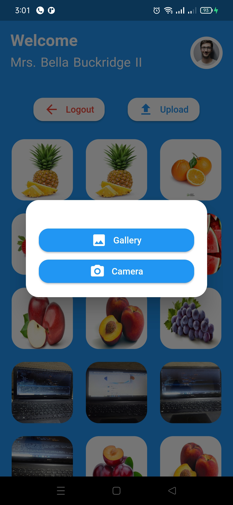

# My Gallery

My Gallery app is an application that stores my images and can upload my new image from my account

## Design pattern & App architecture

- State management : GetX (Separate the UI and business logic & Code easier to test & Code more readable)
- Clean Code
- Responsive design with Phone and Tablets

## ScreenShots

<table>
    <tr>
        <td></td>
        <td></td>
        <td></td>
    </tr>
    <tr>
        <td></td>
        <td></td>
        <td></td>
    </tr>
</table>

## Android Application

Install Application From Google drive [Install](https://drive.google.com/file/d/1sh0rux63ndE11k_06_9tI3PjSC-_UaiM/view?usp=sharing)
